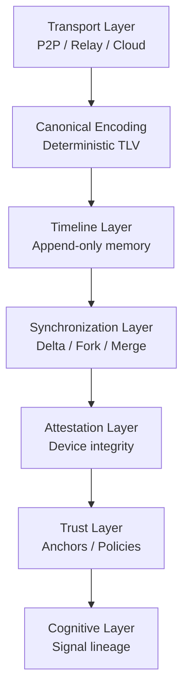

# Veramem Protocol Layers

---

## Description

The Veramem protocol is organized as layered components.

Each layer is:

* independent,
* testable,
* replaceable,
* formally verifiable.

---

## Layer Roles

### Transport Layer

Handles message delivery across:

* peer-to-peer,
* relays,
* federated networks.

It is intentionally abstract.

---

### Canonical Encoding

Ensures:

* deterministic serialization,
* cross-language compatibility,
* signature stability.

---

### Timeline Layer

Provides:

* append-only memory,
* commitments,
* structural integrity.

---

### Synchronization Layer

Implements:

* delta synchronization,
* fork detection,
* safe merge.

---

### Attestation Layer

Verifies:

* device integrity,
* timeline state,
* freshness.

---

### Trust Layer

Supports:

* anchor evolution,
* governance,
* distributed authority.

---

### Cognitive Layer

Builds higher-level reasoning:

* signal lineage,
* explainable cognition,
* structured knowledge evolution.

---

## Key Design Property

Each layer can evolve independently whi
