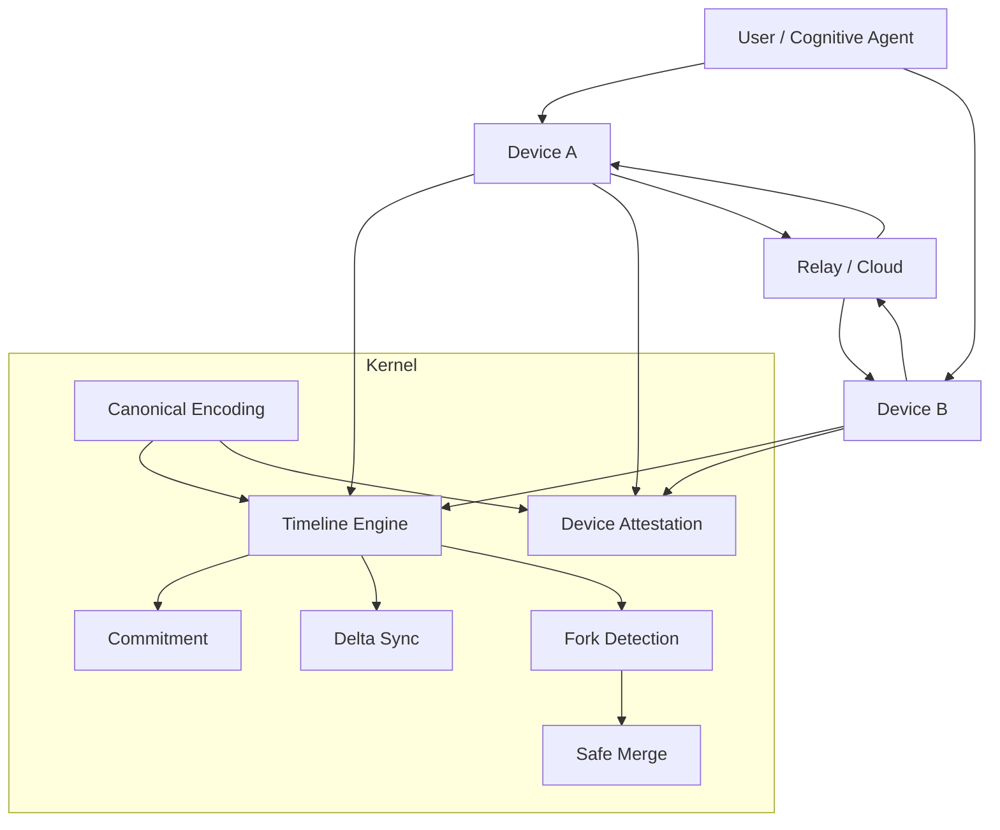

# Veramem System Overview

---

## Description

The Veramem system provides a deterministic and distributed cognitive memory.

Core components:

* Canonical encoding,
* Timeline,
* Synchronization,
* Attestation,
* Trust.

The system is designed to:

* resist adversarial manipulation,
* preserve long-term traceability,
* operate under uncertainty.

---

## Key Properties

* Deterministic.
* Append-only.
* Byzantine-resilient.
* Zero-knowledge compatible.
* Safe under divergence.

---

## Design Philosophy

Safety and stability take priority over convergence and performance.
