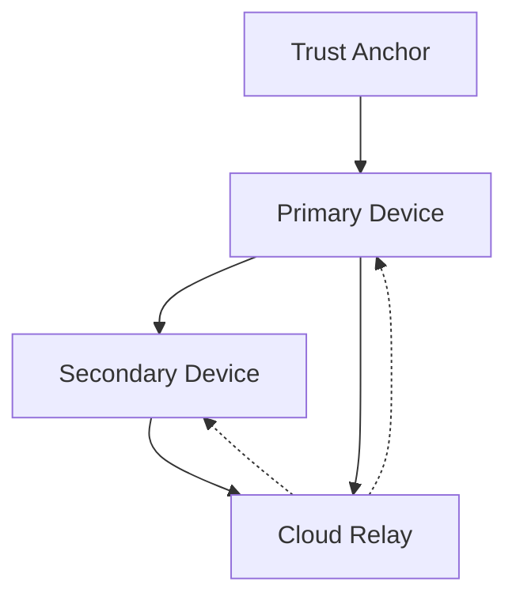

# Veramem Trust Model

---

## Overview

The Veramem trust model is decentralized and progressive.

Trust is built on:

* cryptographic identity,
* structural commitments,
* attestation continuity.

---

## Trust Anchors

A trust anchor represents:

* root authority,
* identity continuity,
* governance foundation.

Anchors may:

* rotate,
* be revoked,
* evolve.

---

## Device Trust Levels

Devices have different roles:

* root devices,
* primary devices,
* auxiliary devices,
* cloud relays.

This prevents single-point compromise.

---

## Progressive Trust

Trust evolves based on:

* behavioral consistency,
* attestation history,
* structural integrity.

---

## Safety Principle

The system prioritizes:

> stability and traceability over forced convergence.

---

## Zero-Knowledge Alignment

Trust decisions rely on:

* commitments,
* signatures,
* structural signals.

Not on raw data.
