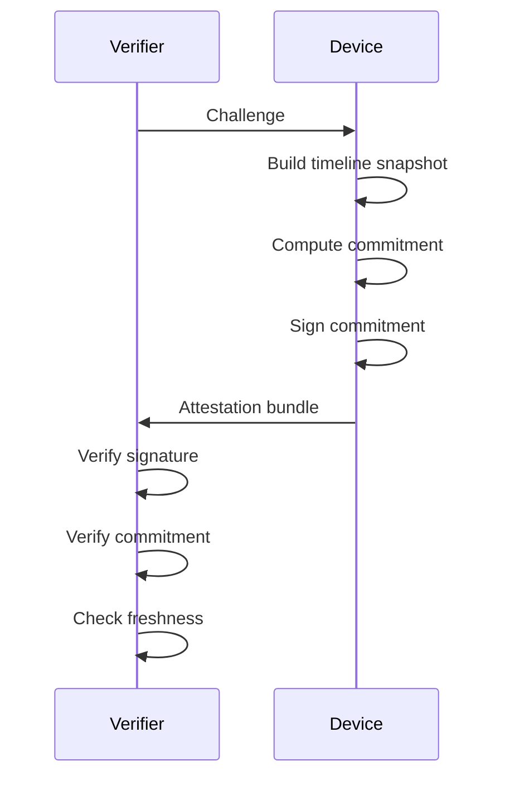

# Device Attestation Flow

---

## Security Properties

* Replay resistance.
* Commitment binding.
* Structural verification.

---

## Zero-Knowledge Alignment

The verifier does not need access to raw memory.
