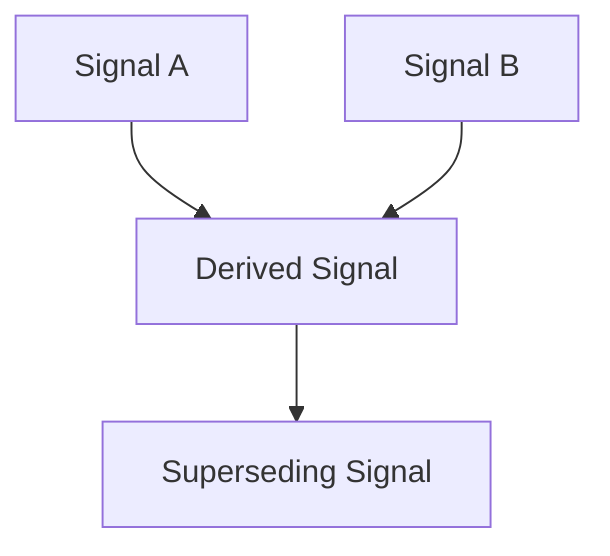

# Signal Lineage Graph

---

## Purpose

Signal lineage provides:

* traceable cognitive evolution,
* deterministic resolution,
* structural explainability.

---

## Key Properties

* Directed acyclic graph.
* Deterministic parent ordering.
* Non-destructive supersession.
* Stability under forks.
