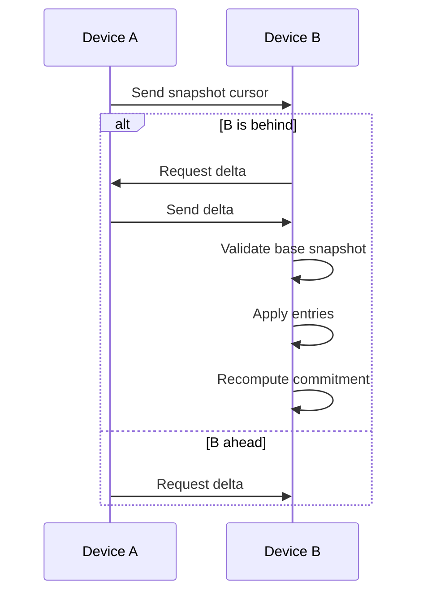

# Delta Synchronization

---

## Overview

Delta synchronization enables efficient timeline updates without transferring full memory.

This ensures:

* bandwidth efficiency,
* offline resilience,
* scalability.

---

## Security Guarantees

### Base Match

A delta is valid only if:

* the base snapshot matches.

This prevents replay attacks.

---

### Append-Only

Deltas:

* cannot rewrite history,
* cannot remove entries.

---

### Deterministic Application

Applying a delta must produce:

* the same commitment on all devices.

---

## Idempotence

Applying the same delta multiple times:

* produces identical results.

---

## Adversarial Resistance

The delta protocol defends against:

* injection attacks,
* reordering,
* corruption,
* partial replay.
