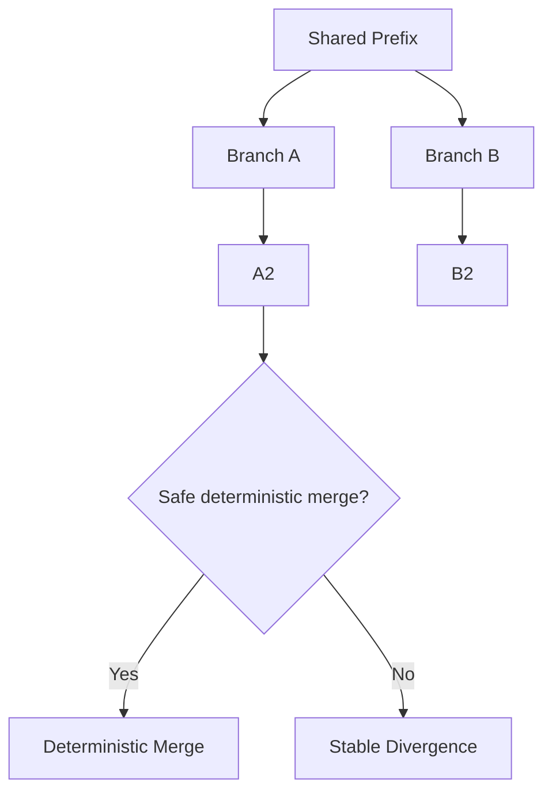

# Fork and Merge Model

---

## Key Principle

Convergence is conditional.

The system:

* merges only when safe,
* preserves divergence otherwise.

---

## Benefits

* Byzantine resilience.
* Long-term stability.
* No destructive resolution.
