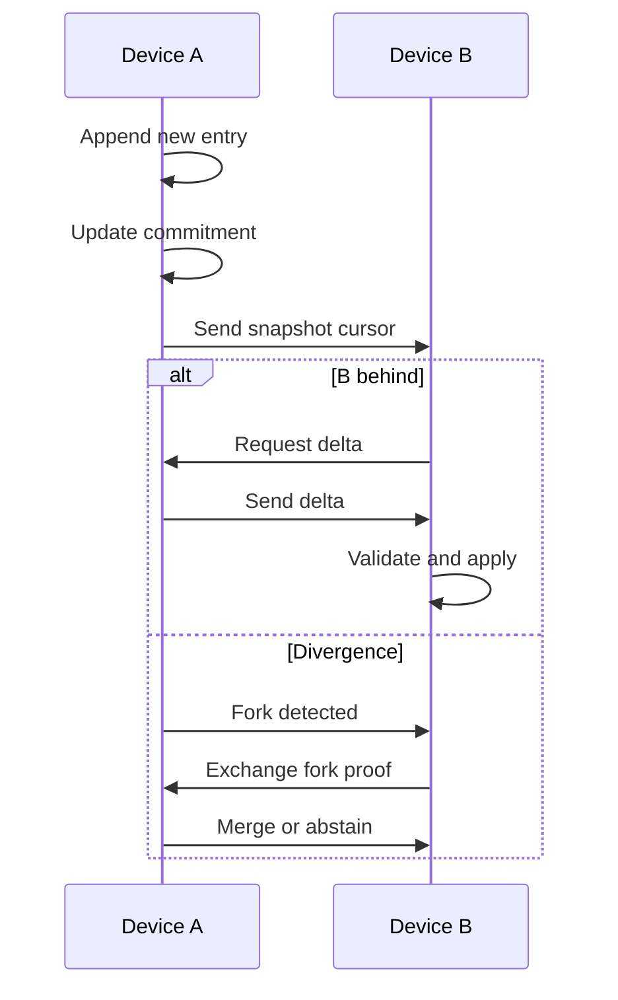

# Timeline Lifecycle

---

## Description

The timeline lifecycle includes:

1. Append-only memory.
2. Commitment updates.
3. Snapshot exchange.
4. Delta synchronization.
5. Fork detection.
6. Safe merge or abstention.

---

## Safety Principle

The system prefers:

> Refusal over unsafe convergence.
